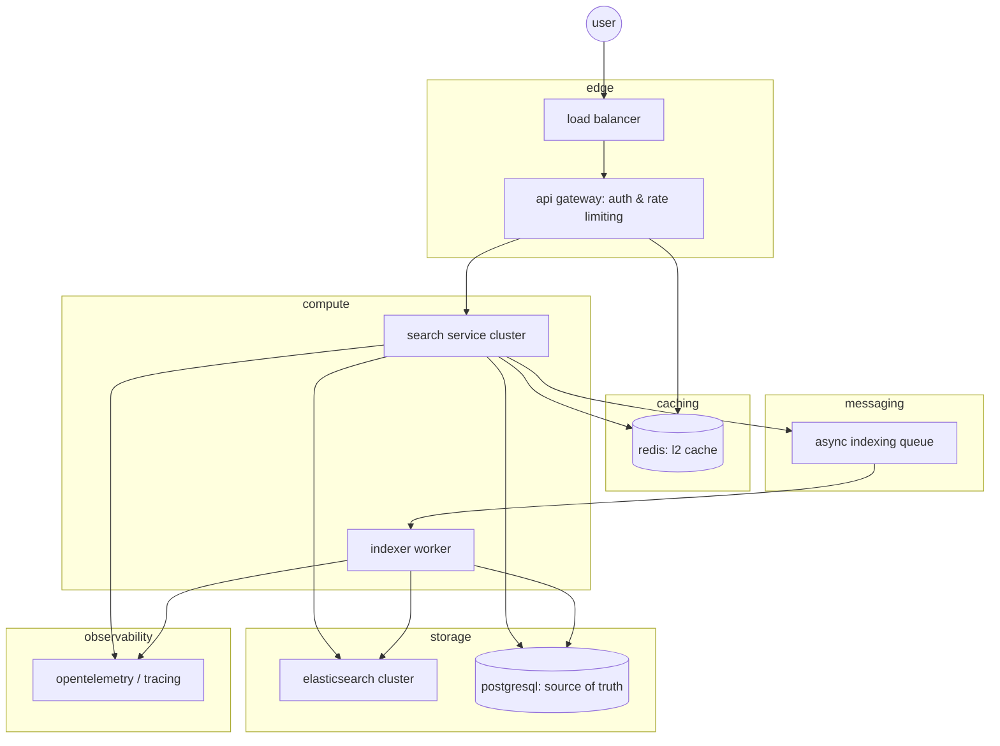
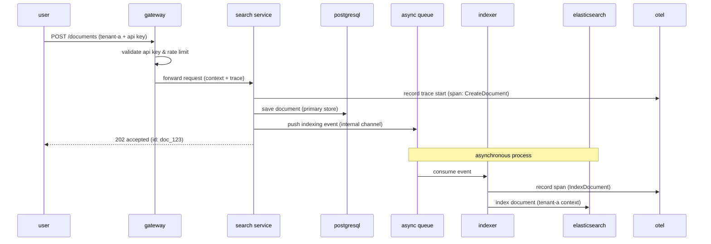
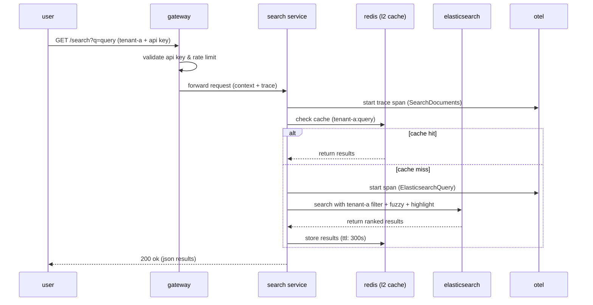

# A design for a Distributed Document Search Service

This document outlines my technical approach, architectural decisions, and production readiness analysis for the Distributed Document Search Service (Ragzero).

Note: Boilerplate code was generated with Claude AI.

---

## 1. Architectural Design

### 1.1 System Overview
I designed this service using a 5-layer distributed architecture. My goal was to ensure horizontal scalability and maintain sub-500ms p95 latency even as document volume grows to 10M+.

### 1.2 Data Flow

#### Indexing (Asynchronous)
I chose an asynchronous indexing pattern to prioritize write availability. When a user uploads a document, I save it to the primary store and return a success response immediately. The heavy search engine indexing happens in the background.

#### Search (Cache-Aside)
For search, I implemented a cache-aside pattern using Redis. I check the cache first to serve frequent queries in under 5ms, only falling back to Elasticsearch on a miss.

### 1.3 Storage Strategy
- **Elasticsearch:** I picked Elasticsearch because it handles full-text relevance (BM25) and horizontal sharding better than traditional databases at this scale. I also enabled **fuzzy matching** for typo tolerance and **result highlighting**.
- **PostgreSQL:** I use Postgres as my source of truth for document metadata. I managed the schema using **versioned SQL migrations** to ensure deployments are repeatable and safe.
- **Redis:** This acts as my L2 cache and rate-limiter. I used named volumes to ensure this data persists even if the service restarts.

### 1.4 Multi-tenancy & Isolation
Isolation is a core part of my design. I enforce it in two places:
1.  **The Edge:** My auth middleware validates API keys against a registry before injecting the tenant identity into the request context only when they have a valid api key.
2.  **The Repository:** I designed the search layer so it's impossible to run a query without a mandatory `tenant_id` filter. This ensures that one tenant can never see another's data.

---

## 2. Production Readiness

### 2.1 Scalability
To handle 100x growth, I'd move from a single index to **tenant-based sharding**. I'd also implement **tiered storage**, keeping active data on SSDs and moving older data to object storage to keep costs low.

### 2.2 Resilience
I implemented Docker healthchecks to ensure the API only starts when the database and search engine are ready. For production, I'd add **circuit breakers** (using a library like `gobreaker`) to prevent a slow Elasticsearch cluster from taking down the entire API.

### 2.3 Observability
I instrumented the code with **OpenTelemetry** for distributed tracing. I also added structured JSON logging using Go's `slog` package, which makes it easy to parse logs and set up alerts in tools like Loki or Datadog.
If required it's very easy to switch to zeroaccocation loggers like zerolog or zap.

---

## 3. Improvements

### 3.1 Indexing at scale
To handle huge indexing scale requirements. I'd switch from buffered channels to a message queue like redis streams, rabbit mq or kafka (only if it's absolutely necessary). Redis streams will be best candidate because redis is already in the stack.

### 3.2 Authentication
A proper mechanism will be needed to generate and manage api keys.

